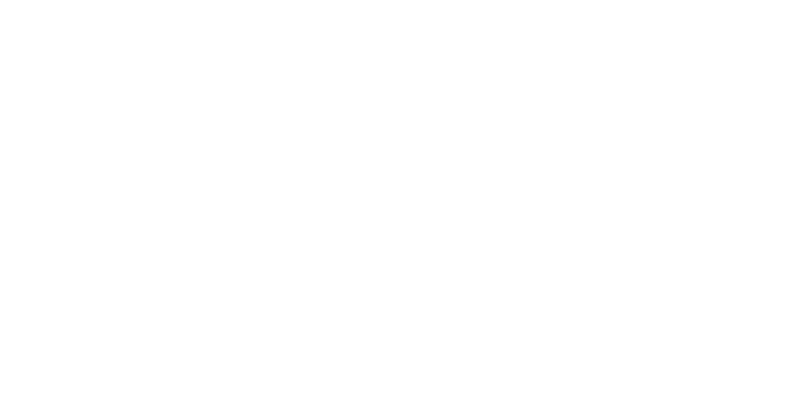

# CURLprit

A Chrome extension that captures network requests and generates curl commands for authenticated downloads.

## Overview

CURLprit intercepts network requests from the active browser tab and converts them to executable curl commands. It preserves cookies and authentication headers, enabling bulk downloads of gated or authorized content directly from the terminal.

## Features

- Capture network requests using Chrome Debugger API
- Filter requests by type (Images, Video, PDF, Documents, CSS, JS, XHR, Fonts)
- Wildcard search support
- Generate curl commands with cookies and headers
- Sequential filename numbering for bulk downloads
- Recording state persists across page refreshes

## Installation

1. Clone this repository
2. Open Chrome and navigate to `chrome://extensions/`
3. Enable **Developer mode**
4. Click **Load unpacked**
5. Select the extension directory

## Usage

1. Navigate to the page containing content to download
2. Click the **Start** button to begin capturing requests
3. Scroll/browse the page to load desired content
4. Use filter tabs to narrow down request types
5. Select requests via checkboxes
6. Enter file extension and prefix for naming
7. Click **Get Curl** to generate commands
8. Copy commands to terminal for execution

## Permissions

- `debugger` - Capture network traffic
- `cookies` - Include authentication cookies in curl commands
- `storage` - Persist recording state
- `tabs`, `activeTab` - Access current tab
